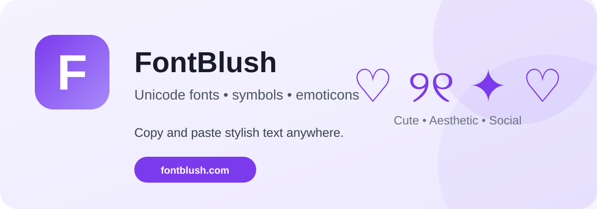

# FontBlush Unicode Tools

<p align="center">
  
</p>

<p align="center">
  <strong>Free Unicode text tools for stylish copy and paste.</strong><br>
  Pick a style, copy the result, and use it in bios, usernames, captions, messages, and more.
</p>

<p align="center">
  <a href="https://fontblush.com">Website</a> ·
  <a href="https://fontblush.com/cute-symbols/">Cute Symbols</a> ·
  <a href="https://fontblush.com/bow-symbols/">Bow Symbols</a> ·
  <a href="https://fontblush.com/cute-emoticons/">Cute Emoticons</a>
</p>

## ✨ What is FontBlush?

FontBlush is a collection of free Unicode-based text tools. The tools generate copy-and-paste text, symbols, and emoticons that can be used across many websites and apps without installing a special font.

### Popular tools

| Tool | Description |
| --- | --- |
| [Cute Symbols](https://fontblush.com/cute-symbols/) | Cute Unicode symbols for bios, captions and messages |
| [Bow Symbols](https://fontblush.com/bow-symbols/) | Bow and ribbon-style Unicode symbols |
| [Cute Emoticons](https://fontblush.com/cute-emoticons/) | Copy-and-paste kaomoji and cute emoticons |
| [FontBlush](https://fontblush.com) | Full collection of FontBlush tools |

## 🧩 How Unicode text works

Unicode characters are ordinary text characters. That means many FontBlush results can be copied and pasted into places such as social profiles, usernames, captions and messages.

Display support depends on the app, browser, operating system and installed fonts. If a character appears as a square or box, try another Unicode character or style.

## 🎯 Design goals

- Free and easy to use
- No signup required for basic tools
- No software download required
- Fast copy-and-paste workflow
- Useful on desktop and mobile
- Clear, accessible Unicode references

## 📁 Repository

This repository is the public home for FontBlush project resources, documentation, branding assets and future Unicode-related tools.

Current structure:

```text
fontblush-unicode-tools/
├── assets/
│   ├── fontblush-banner.svg
│   └── fontblush-logo.svg
├── LICENSE
└── README.md
```

## 🌐 Website

Visit **[FontBlush](https://fontblush.com)** for the complete collection of Unicode fonts, symbols and emoticons.

## 📄 License

This project is released under the [MIT License](LICENSE).

---

Made with ♡ by the FontBlush team.
